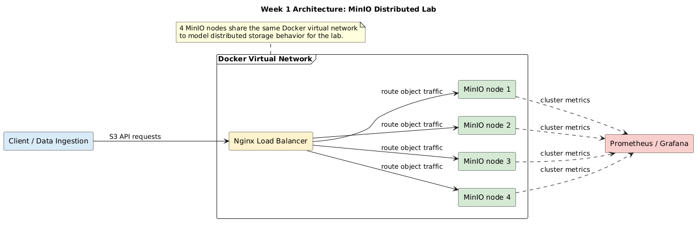

# Phân Tán Hóa Lưu Trữ Dữ Liệu Lớn: Mô Phỏng Kiến Trúc Data Lake Bằng MinIO

Hệ thống triển khai cụm lưu trữ phân tán (Distributed Object Storage) mô phỏng kiến trúc S3, tập trung vào khả năng chịu lỗi (Fault Tolerance) và khả năng mở rộng (Scalability).

## 0. Cấu trúc thư mục

```text
cloud-native-minio-lab/
├── .env.example                  # Mẫu biến môi trường an toàn
├── .github/                      # CI/CD và mẫu PR
│   └── workflows/
│       └── ci.yml                # Luồng kiểm tra tự động
├── .gitignore                    # Danh sách file/thư mục cần bỏ qua
├── docs/                         # Tài liệu dự án
│   ├── architecture/
│   │   └── .gitkeep              # Giữ chỗ cho sơ đồ kiến trúc
│   ├── chaos_engineering/
│   │   └── .gitkeep              # Tài liệu và log kiểm thử sập hệ thống
│   ├── meeting_logs/
│   │   └── .gitkeep              # Nhật ký họp và làm việc nhóm
│   └── reports/
│       └── .gitkeep              # Báo cáo nháp và báo cáo chính thức
├── infra/                        # Hạ tầng triển khai bằng Docker Compose
│   ├── docker-compose.yml        # Khai báo 4 node MinIO, Nginx, Prometheus, Grafana
│   ├── grafana/
│   │   └── dashboards/
│   │       └── README.md         # Nơi lưu dashboard JSON để import nhanh
│   ├── minio/
│   │   └── README.md             # Cấu hình MinIO tùy chỉnh nếu cần
│   ├── nginx/
│   │   └── nginx.conf            # Cấu hình load balancer Nginx
│   └── prometheus/
│       └── prometheus.yml        # Cấu hình scrape metrics
├── LICENSE                       # Thông tin giấy phép dự án
├── Makefile                      # Lệnh tắt cho tác vụ thường dùng
├── README.md                     # Tài liệu hướng dẫn tổng quan
├── scripts/                      # Script tự động hóa và mô phỏng dữ liệu
│   ├── data_ingestion.py         # Tạo dữ liệu theo partition
│   ├── load_generator.py         # Sinh tải đa luồng để stress test
│   ├── mc_setup.sh               # Tự động cấu hình MinIO Client
│   ├── requirements.txt          # Thư viện Python cần cài
│   └── verify_checksum.py        # Kiểm tra tính toàn vẹn dữ liệu
└── tests/                        # Kịch bản kiểm thử và chaos engineering
    └── chaos_scenarios.md        # Mô tả các tình huống kiểm thử
```

## 1. Tóm tắt Mục tiêu và Bài toán
Hệ thống lưu trữ tập trung truyền thống luôn tiềm ẩn rủi ro khi mở rộng quy mô (Scale-up) hoặc khi xảy ra sự cố lỗi phần cứng ở một máy chủ đơn lẻ.
Dự án này giải quyết bài toán đó bằng cách thiết kế và triển khai một cụm lưu trữ phân tán, qua đó:
- Khắc phục rủi ro mất mát dữ liệu của các máy chủ đơn điểm (Single Point of Failure).
- Đánh giá và phân tích sự khác biệt về mặt kiến trúc giữa File Storage truyền thống và Object Storage hiện đại.
- Ứng dụng thuật toán Erasure Coding để đảm bảo tính toàn vẹn của dữ liệu trong môi trường đám mây giả lập.

## 2. Kiến trúc Hệ thống (System Architecture)

Runbook chạy và kiểm thử theo flow 6 tuần: [`docs/project-runbook.md`](docs/project-runbook.md).

Hệ thống được thiết kế theo mô hình phân tán hoàn toàn (Distributed Mode) với các thành phần:
- **Tầng Ứng dụng (Client/Data Ingestion):** Script tự động tương tác qua S3 API để nạp tải dữ liệu (Load Generation).
- **Tầng Lưu trữ (Storage Layer):** Cụm 4 node MinIO chạy distributed mode trên nền tảng Docker Container, cùng tham gia một mạng ảo (Virtual Network) để tạo thành một Single Storage Pool.
- **Tầng Giám sát (Monitoring - Tùy chọn):** Thu thập metrics về thông lượng (Throughput) và độ trễ (Latency).

## 3. Khởi chạy Nhanh (Quick Start)
Dự án được đóng gói hoàn toàn bằng Infrastructure as Code (IaC) thông qua Docker Compose.

**Yêu cầu hệ thống:**
- Docker Engine >= 20.10
- Docker Compose >= 2.0

**Lệnh khởi chạy:**
```powershell
git clone https://github.com/PhanThienLoc/cloud-native-minio-lab.git
cd cloud-native-minio-lab
Copy-Item .env.example .env
docker compose --env-file .env -f infra/docker-compose.yml config --quiet
docker compose --env-file .env -f infra/docker-compose.yml up -d
docker compose --env-file .env -f infra/docker-compose.yml ps
```
