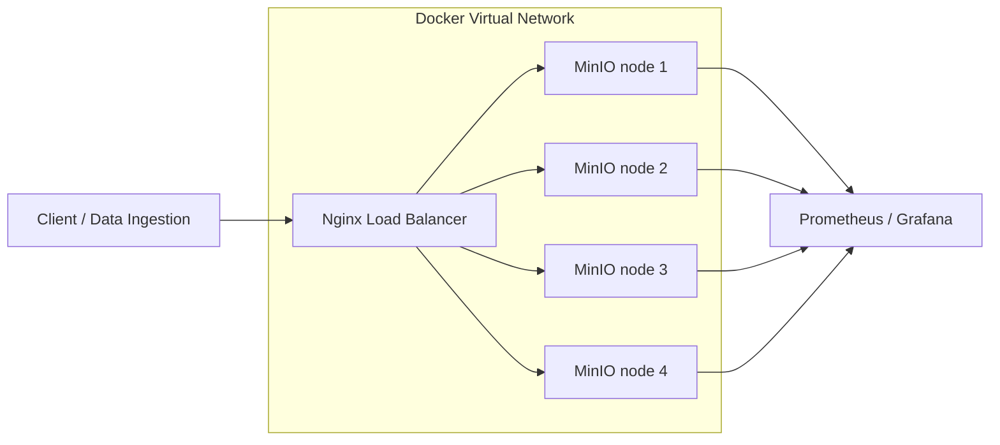

# Week 1 Architecture: MinIO Distributed Lab

## Mục tiêu
Thiết kế kiến trúc lab mô phỏng lưu trữ phân tán bằng MinIO, đảm bảo đúng 3 lớp:
- Client / Data Ingestion
- Storage Layer
- Monitoring Layer

## Sơ đồ kiến trúc

## Vai trò từng lớp
- Client: nạp dữ liệu qua S3 API và kiểm tra luồng upload/download.
- Nginx: điểm vào duy nhất, giúp tách client khỏi storage nodes.
- MinIO 4 node: nền tảng cho distributed mode và erasure coding.
- Prometheus/Grafana: thu metrics, quan sát throughput, latency, trạng thái node.

## Vì sao cần 4 node
- MinIO distributed mode cần tối thiểu 4 drive/node để kích hoạt erasure coding đúng nghĩa.
- 4 node giúp mô phỏng chịu lỗi tốt hơn 1-node standalone.
- Kiến trúc này phù hợp để benchmark, chaos test và chứng minh tính sẵn sàng.

## Artifact đi kèm
- `week1-minio-architecture.puml`

## Ghi chú
- File `.puml` là nguồn sơ đồ chính để tiếp tục chỉnh sửa bằng PlantUML.
- File Markdown này giữ vai trò tham chiếu nội dung và giải thích kiến trúc.
