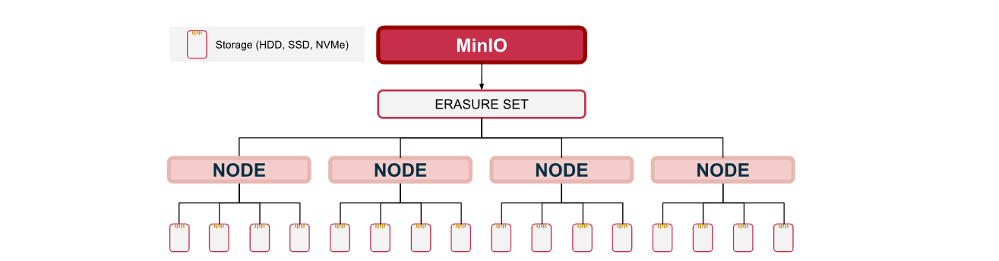

# Chương 2: Cơ sở lý thuyết

## 2.1 Các mô hình lưu trữ

Trong các hệ thống công nghệ thông tin hiện đại, dữ liệu có thể được lưu trữ theo nhiều mô hình khác nhau tùy thuộc vào mục đích sử dụng và yêu cầu của ứng dụng. Ba mô hình phổ biến nhất là File Storage, Block Storage và Object Storage.

### File Storage

File Storage là mô hình lưu trữ truyền thống, trong đó dữ liệu được tổ chức dưới dạng các tệp (file) và thư mục (folder) theo cấu trúc phân cấp. Người dùng truy cập dữ liệu thông qua đường dẫn (path) của từng tệp. Mô hình này phù hợp với việc chia sẻ tài liệu, lưu trữ văn bản và các hệ thống file server trong doanh nghiệp.

### Block Storage

Block Storage lưu dữ liệu thành các khối (block) có kích thước cố định. Mỗi block được gán một địa chỉ riêng và hệ điều hành sẽ ghép các block thành tệp khi cần sử dụng. Mô hình này có hiệu năng cao, thường được sử dụng trong cơ sở dữ liệu, máy ảo và các hệ thống yêu cầu tốc độ đọc/ghi lớn.

### Object Storage

Object Storage lưu dữ liệu dưới dạng các đối tượng (object). Mỗi object bao gồm dữ liệu, metadata và một khóa định danh (object key). Không giống File Storage, Object Storage không sử dụng cấu trúc thư mục phân cấp mà tổ chức dữ liệu theo không gian tên phẳng (flat namespace). Mô hình này rất phù hợp cho việc lưu trữ dữ liệu phi cấu trúc có dung lượng lớn như hình ảnh, video, bản sao lưu, log hệ thống và dữ liệu phục vụ Big Data hoặc AI.
## 2.2 So sánh File Storage và Object Storage

File Storage và Object Storage đều được sử dụng để lưu trữ dữ liệu, tuy nhiên chúng được thiết kế cho các mục đích khác nhau. File Storage phù hợp với các hệ thống chia sẻ tệp truyền thống, trong khi Object Storage được tối ưu cho môi trường điện toán đám mây, lưu trữ dữ liệu phi cấu trúc và khả năng mở rộng quy mô lớn.

| Tiêu chí             | File Storage                  | Object Storage                                |
| -------------------- | ----------------------------- | --------------------------------------------- |
| Đơn vị lưu trữ       | File                          | Object                                        |
| Tổ chức dữ liệu      | Cây thư mục (Directory Tree)  | Flat Namespace                                |
| Định danh            | Đường dẫn (Path)              | Object Key                                    |
| Metadata             | Hạn chế                       | Linh hoạt, có thể mở rộng                     |
| Phương thức truy cập | NFS, SMB, POSIX               | HTTP/REST, S3 API                             |
| Khả năng mở rộng     | Khó mở rộng ngang             | Phù hợp mở rộng ngang (Horizontal Scaling)    |
| Trường hợp sử dụng   | File Server, chia sẻ tài liệu | Backup, Media Storage, Log Storage, Data Lake |

Trong Object Storage, dữ liệu được tổ chức theo **bucket** và **object**. Mỗi object được xác định bằng một **object key** duy nhất. Mặc dù nhiều công cụ quản lý hiển thị dữ liệu theo dạng thư mục để người dùng dễ thao tác, nhưng về bản chất Object Storage sử dụng **không gian tên phẳng (Flat Namespace)** thay vì cấu trúc thư mục phân cấp như File Storage.
## 2.3 MinIO và S3-compatible Object Storage

MinIO là một hệ thống Object Storage mã nguồn mở được thiết kế với hiệu năng cao và khả năng mở rộng tốt. MinIO tương thích với chuẩn Amazon S3 (S3-compatible API), cho phép các ứng dụng sử dụng cùng một giao diện lập trình (API) như khi làm việc với dịch vụ Amazon S3.

Trong MinIO, dữ liệu được tổ chức theo hai thành phần chính:

* **Bucket:** Là vùng chứa dữ liệu, tương tự như thư mục cấp cao nhất trong hệ thống lưu trữ đối tượng.
* **Object:** Là đơn vị lưu trữ cơ bản, bao gồm dữ liệu, metadata và object key.

Mỗi object được xác định bằng một **object key** duy nhất trong bucket. Ngoài dữ liệu chính, object còn chứa **metadata** giúp mô tả các thuộc tính như kiểu tệp (Content-Type), thời gian tạo, kích thước và các thông tin mở rộng khác.

MinIO hỗ trợ đầy đủ các thao tác cơ bản của S3 API, bao gồm:

* **PUT:** Tải (upload) object lên bucket.
* **GET:** Tải (download) object từ bucket.
* **LIST:** Liệt kê bucket hoặc danh sách object.
* **DELETE:** Xóa object hoặc bucket theo quyền được cấp.

Nhờ khả năng tương thích với chuẩn S3, MinIO có thể tích hợp với nhiều công cụ và thư viện phổ biến như MinIO Client (mc), AWS CLI, Python SDK (boto3), Java SDK và các ứng dụng hỗ trợ giao thức Amazon S3.
## 2.4 Distributed Storage

Distributed Storage (lưu trữ phân tán) là mô hình lưu trữ trong đó dữ liệu không được đặt trên một máy chủ duy nhất mà được phân phối trên nhiều node trong cùng một cụm (cluster). Các node này phối hợp với nhau để cung cấp cho người dùng một hệ thống lưu trữ thống nhất, đồng thời nâng cao khả năng mở rộng và tính sẵn sàng của dịch vụ.

So với mô hình lưu trữ tập trung, Distributed Storage mang lại nhiều ưu điểm:

* **Khả năng mở rộng ngang (Horizontal Scaling):** Khi nhu cầu lưu trữ tăng lên, hệ thống có thể bổ sung thêm node vào cụm mà không cần thay thế toàn bộ hạ tầng hiện có.
* **Tính sẵn sàng cao (High Availability):** Nếu một node gặp sự cố, các node còn lại vẫn tiếp tục cung cấp dịch vụ, giúp giảm nguy cơ gián đoạn.
* **Cân bằng tải:** Dữ liệu và các yêu cầu truy cập được phân phối giữa nhiều node, giúp giảm tải cho từng máy chủ và cải thiện hiệu năng của toàn hệ thống.

Trong hệ thống lưu trữ phân tán, hạ tầng mạng đóng vai trò rất quan trọng vì các node phải liên tục trao đổi dữ liệu và trạng thái với nhau. Bên cạnh đó, hệ thống cần có cơ chế phối hợp giữa các node (distributed coordination/consensus ở mức khái niệm) để duy trì tính nhất quán của dữ liệu và đảm bảo các thành viên trong cụm hoạt động đồng bộ.
## 2.5 Erasure Coding

Erasure Coding là cơ chế bảo vệ dữ liệu được nhiều hệ thống lưu trữ phân tán hiện đại sử dụng nhằm tăng khả năng phục hồi khi xảy ra lỗi phần cứng. Thay vì tạo nhiều bản sao hoàn chỉnh của dữ liệu như phương pháp Replication, Erasure Coding chia dữ liệu thành nhiều phần nhỏ (data shards) và tạo thêm các phần kiểm tra (parity shards).

Các data shard và parity shard được phân phối trên nhiều ổ đĩa hoặc nhiều node khác nhau trong cụm lưu trữ. Khi một số ổ đĩa hoặc node gặp sự cố, hệ thống có thể sử dụng các shard còn lại kết hợp với parity shard để tái tạo dữ liệu bị mất, từ đó giảm nguy cơ mất dữ liệu và duy trì khả năng truy cập.

So với cơ chế Replication, Erasure Coding có một số ưu điểm:

* Sử dụng dung lượng lưu trữ hiệu quả hơn.
* Vẫn đảm bảo khả năng bảo vệ dữ liệu khi xảy ra lỗi phần cứng.
* Phù hợp với các hệ thống lưu trữ phân tán có quy mô lớn.

Trong dự án này, MinIO sử dụng Erasure Coding để tăng độ tin cậy của hệ thống lưu trữ. Tuy nhiên, khả năng chịu lỗi cụ thể của cụm phụ thuộc vào cấu hình thực tế của hệ thống, bao gồm số lượng ổ đĩa, cơ chế parity và quorum. Vì vậy, báo cáo này không khẳng định cụm có thể chịu được chính xác bao nhiêu node hoặc ổ đĩa bị lỗi nếu chưa có kết quả kiểm thử thực tế.
## 2.6 Sharding

Sharding là kỹ thuật chia dữ liệu thành nhiều phần nhỏ (shards) để phân phối trên nhiều ổ đĩa hoặc nhiều node trong hệ thống lưu trữ phân tán. Việc phân chia này giúp tránh tập trung toàn bộ dữ liệu vào một vị trí duy nhất, từ đó cải thiện khả năng mở rộng và hiệu năng của hệ thống.

Trong các hệ thống Object Storage hiện đại, dữ liệu của một object có thể được chia thành nhiều phần và phân phối trên các node hoặc ổ đĩa khác nhau. Cách tổ chức này mang lại nhiều lợi ích:

* **Phân tán dữ liệu:** Dữ liệu được lưu trên nhiều vị trí thay vì tập trung vào một node.
* **Tăng hiệu năng:** Nhiều node có thể xử lý các yêu cầu đọc và ghi đồng thời, giúp cải thiện tốc độ truy cập.
* **Hỗ trợ mở rộng:** Khi cần tăng dung lượng lưu trữ hoặc hiệu năng, hệ thống có thể bổ sung thêm node mà không phải thay đổi toàn bộ kiến trúc.
* **Hỗ trợ chịu lỗi:** Khi kết hợp với Erasure Coding, việc phân phối các shard trên nhiều node giúp tăng khả năng khôi phục dữ liệu khi xảy ra sự cố.

Trong dự án này, cơ chế phân phối dữ liệu của MinIO kết hợp với mô hình lưu trữ phân tán nhằm xây dựng một hệ thống có khả năng mở rộng, đảm bảo tính sẵn sàng và nâng cao độ tin cậy của dữ liệu.
## 2.7 Kiến trúc hệ thống

Hình 2.1 minh họa kiến trúc tổng thể của hệ thống lưu trữ phân tán được xây dựng trong dự án. Hệ thống bao gồm một máy khách (Client) gửi yêu cầu thông qua Nginx Load Balancer. Nginx đóng vai trò là điểm truy cập duy nhất (Single Entry Point), tiếp nhận và phân phối các yêu cầu đến cụm gồm bốn node MinIO.

Bốn node MinIO được kết nối với nhau thông qua mạng Docker (`minio-net`) để tạo thành một cụm lưu trữ phân tán. Mỗi node quản lý dữ liệu của mình và phối hợp với các node còn lại trong quá trình lưu trữ, truy xuất và bảo vệ dữ liệu. Trong các giai đoạn tiếp theo của dự án, hệ thống giám sát sẽ được bổ sung nhằm thu thập các chỉ số về hiệu năng và trạng thái hoạt động của cụm.
Mỗi node MinIO được gắn với hai volume lưu trữ nhằm phục vụ cơ chế phân phối dữ liệu và nâng cao khả năng chịu lỗi của hệ thống.
Kiến trúc tổng thể hệ thống lưu trữ phân tán bằng MinIO

## Tài liệu tham khảo

1. MinIO Documentation: https://min.io/docs/
2. Amazon S3 User Guide: https://docs.aws.amazon.com/AmazonS3/latest/userguide/
3. Docker Documentation: https://docs.docker.com/
4. Nginx Documentation: https://nginx.org/en/docs/
